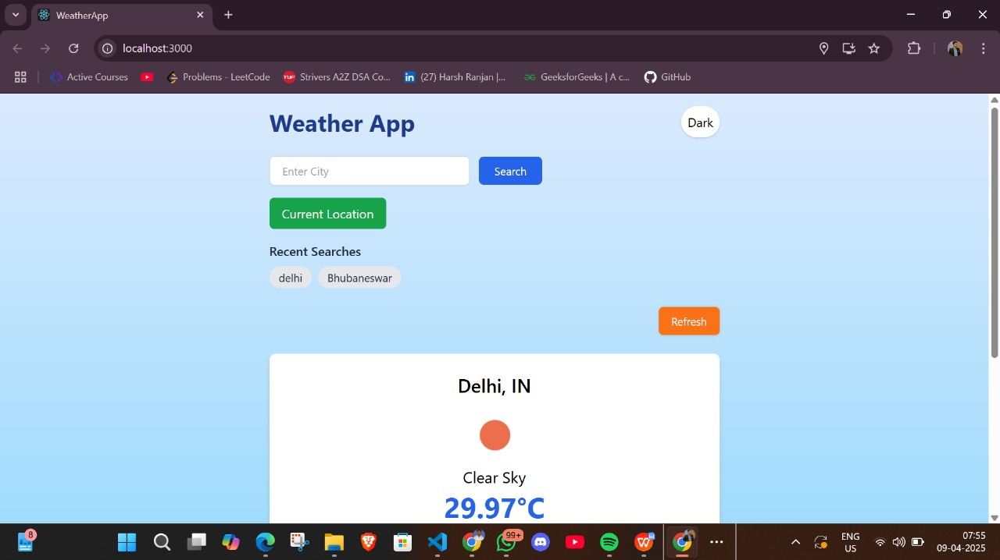

# 🌤️ Weather App

A simple, responsive weather app built using **React** and **Tailwind CSS**.

This project lets users:
- Search for weather by city
- View current weather and a 5-day forecast
- Use their current location to get local weather
- Switch between light and dark themes
- Quickly revisit recent searches
- Refresh weather data with a single click

---

## ✨ Features

- 🔍 **City Search** – Enter any city to get live weather updates
- 📍 **Current Location** – Get weather based on your location
- 📅 **5-Day Forecast** – Preview weather trends for upcoming days
- 🕘 **Search History** – See your last 5 searched cities
- 🔁 **Refresh Button** – Reload weather for the selected city
- 🌗 **Theme Toggle** – Switch between dark and light mode
- ⏳ **Loader** – Spinner shown while fetching data

---

## 📸 Screenshot



---

## 🛠 Tech Stack

- ⚛️ React (functional components & hooks)
- 💨 Tailwind CSS
- 🌐 OpenWeatherMap API
- 💾 LocalStorage (for saving theme and search history)

---

## 🚀 Getting Started

To run this project locally:

### 1. Clone the repo

```bash
git clone https://github.com/harshranjan2804/weather-app.git
cd weather-app
